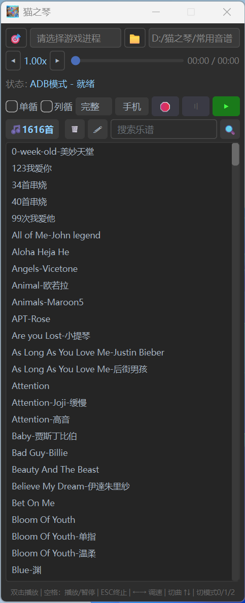
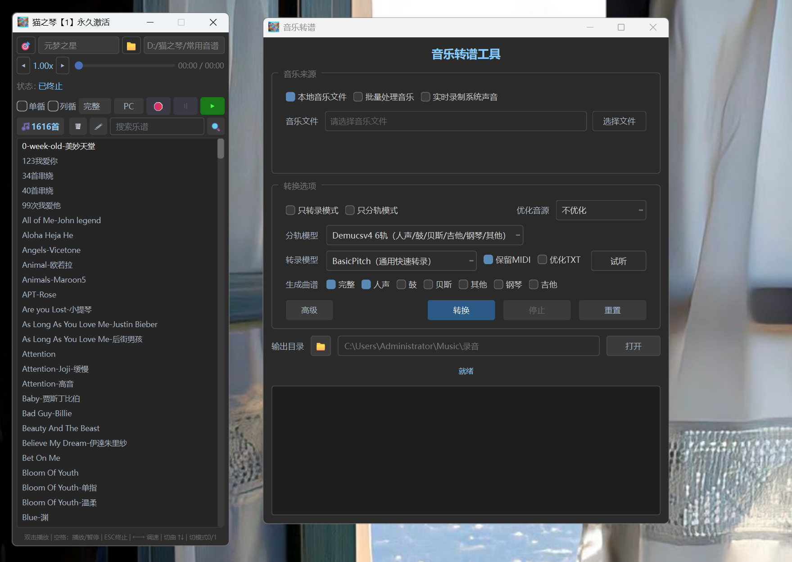

<div align="center">

# 猫之琴

一个 Windows 平台的 21 琴键游戏自动弹奏工具，让游戏里的弹奏像播放音乐一样简单。


</div>

## 软件简介

【猫之琴】是一款Windows上的游戏自动弹琴软件，支持 `MIDI` 和 `TXT` 乐谱。

适用于原神、蛋仔派对、元梦之星、永劫无间、逆水寒、摩尔庄园、第五人格等游戏

只要游戏内有 21 个琴键，就可以自动弹奏。可以把它当作一个“游戏弹琴播放器”

## 功能特性

- 支持 `MIDI` 和 `TXT` 乐谱文件
- 能自动弹奏（QWERTYU，ASDFGHJ，ZXCVBNM）三排琴键
- 支持所有21琴键的电脑游戏，模拟器，安卓手机游戏
- 支持PC、安卓手机弹奏、安卓抖音点赞三种模式
- 支持快捷键操作，可调节速度，单曲循环、列表循环
- 并提供手机悬浮窗控制程序 GMAUT.apk，可以在ADB模式时控制

## 下载安装

直接下载 Releases 中的压缩包，解压后运行 `猫之琴轻量版.exe` 即可
👉 [下载猫之琴 v1.0.0](https://github.com/osirisaewqsd/GM1/releases/tag/v1.0.0)

如果需要`猫之琴终极版`，可联系QQ `1016499728`

终极版内置了7种前沿模型，可把歌曲音频文件直接转成 MIDI 和 TXT电子简谱，供猫之琴弹奏，并提供 MIDI 编辑器。
1、分轨模型：（BS-Roformer-Leap）
2、分轨模型：（DemucsV4 6s）

3、快速转录模型：（BasicPitch）
4、人声转录模型：（GAME 人声清唱系列）
5、钢琴高精转录模型：（Transkun）
6、钢琴高精转录模型：（PianoTrans）
7、AI钢琴改编模型：（AI钢琴改编Pop2Piano）


## 界面截图





## 使用说明

### PC 模式

适用于电脑上的游戏、模拟器等。

1. 选择游戏进程
2. 双击乐谱开始播放
3. 点击游戏窗口后即可自动弹奏
4. 离开游戏窗口后会自动停止弹奏

### 安卓手机弹奏模式

需要电脑和手机处于同一个 WiFi 网络中。

1. 点击 `ADB 模式 - 就绪`，打开辅助面板
2. 手机进入开发者模式，并开启无线调试
3. 使用扫码功能自动连接 ADB 无线调试
4. 连接成功后，在手机中打开游戏
5. 双击乐谱播放，电脑会自动向手机下发弹奏指令

如果需要用手机控制电脑，可以安装压缩包内的 `GMAUT.apk`，授予悬浮窗权限后即可使用。

### 安卓手机点赞模式

需要电脑和手机处于同一个 WiFi 网络中。

1. 点击 `ADB 模式 - 就绪`，打开辅助面板
2. 手机进入开发者模式，并开启无线调试
3. 使用扫码功能自动连接 ADB 无线调试
4. 在手机中打开抖音直播页面
5. 在竖屏状态下，工具会自动发送点击指令进行点赞

## 快捷键

| 按键 | 功能 |
| --- | --- |
| 双击乐谱 | 播放 |
| 上 / 下箭头 | 切换歌曲 |
| 左 / 右箭头 | 调节速度 |
| 空格 | 播放 / 暂停 |
| 数字键 0 | 完整弹奏 |
| 数字键 1 | 只保留最高音 |
| 数字键 2 | 跳过背景音弹奏 |

## 开发与构建

环境要求：

- Windows 10 / 11
- Python 3.11.9

安装依赖：

```powershell
python -m venv .venv
.\.venv\Scripts\Activate.ps1
pip install -e .
```

运行：

```powershell
python main.py
```

打包：

```powershell
.\打包.bat
```

## 项目结构

```text
GM1
├── core/       核心逻辑：乐谱解析、播放引擎、GMAUT 桥接
├── gui/        PySide6 界面
├── license/    授权相关模块
├── resources/  图标、ADB 等资源文件
├── utils/      ADB 无线连接、二维码、窗口工具等
├── main.py     程序入口
├── build.ps1   打包脚本
└── pyproject.toml
```

## 开源协议

本项目使用 [MIT License](LICENSE.md) 开源。

## 免责声明

本项目仅用于学习、研究和自动化技术交流。使用本工具自动弹奏、自动点赞等行为可能违反对应游戏或平台的使用规则。请遵守相关平台和游戏的服务条款，使用者需自行承担由此产生的一切后果。
